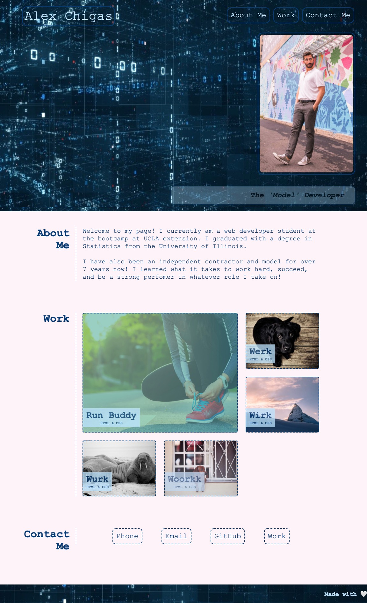

# Alex Chigas | Portfolio
Web development portfolio for Alex Chigas 

## Table of contents
* [General info](#general-info)
* [URL](#URL)
* [Screenshots](#screenshots)
* [Code](#Code)
* [Status](#status)
* [Inspiration](#inspiration)
* [Contact](#contact)

## General info
The purpose of this project is to create an eye-catching portfolio to show to potential employers. 

## URL 
[Alex Chigas' Portfolio](https://achigas.github.io/AChigas-Portfolio/)

## Screenshots

## Code
HTML
CSS

## Status
Web development projects will be added to the 'Work' section. The placeholder images will be removed. 

## Inspiration
Inspired by UCLA Bootcamp challenge two and Alex Chigas.

## Contact
Created by Alex Chigas. Feel free to contact me!